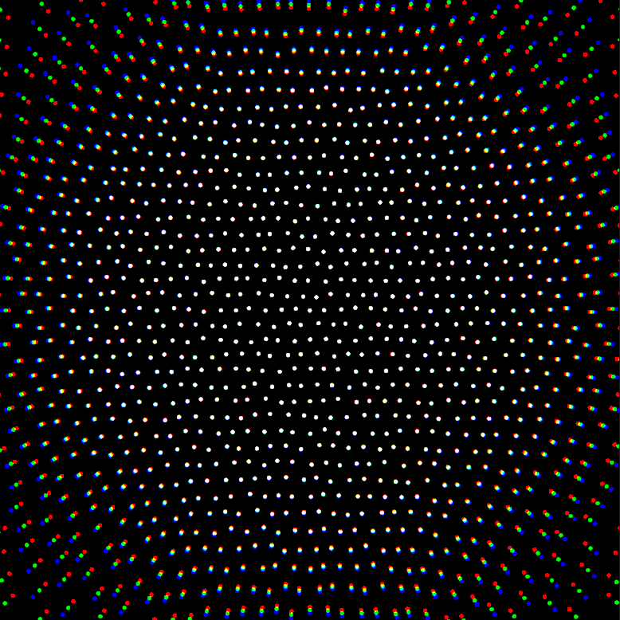

# Recreating a Dave Whyte Animation in React-Three-Fiber

Learn how to use instanced rendering and post-processing techniques to recreate a hypnotic animation with react-three-fiber.

By Matt Rossman



[Article on Codrops](https://tympanus.net/codrops/?p=52356)

[Demo](http://tympanus.net/Tutorials/BreathingDots/)

## Installation

Install dependencies:

```
yarn install
```

Compile the code for development and start a local server:

```
yarn start
```

Create the build:

```
yarn build
```

## Credits

- [react-three-fiber](https://github.com/pmndrs/react-three-fiber)
- [three.js](https://threejs.org/)
- [React](https://reactjs.org/)
- [Dave Whyte](http://beesandbombs.com/)

## Misc

Follow Matt Rossman: [Twitter](https://twitter.com/the_ross_man), [GitHub](https://github.com/mattrossman)

Follow Codrops: [Twitter](http://www.twitter.com/codrops), [Facebook](http://www.facebook.com/codrops), [GitHub](https://github.com/codrops), [Instagram](https://www.instagram.com/codropsss/)

## License

[MIT](LICENSE)

Made with :blue_heart: by [Codrops](http://www.codrops.com)
